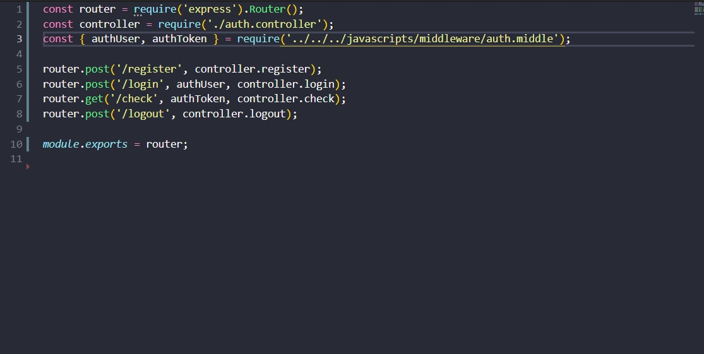
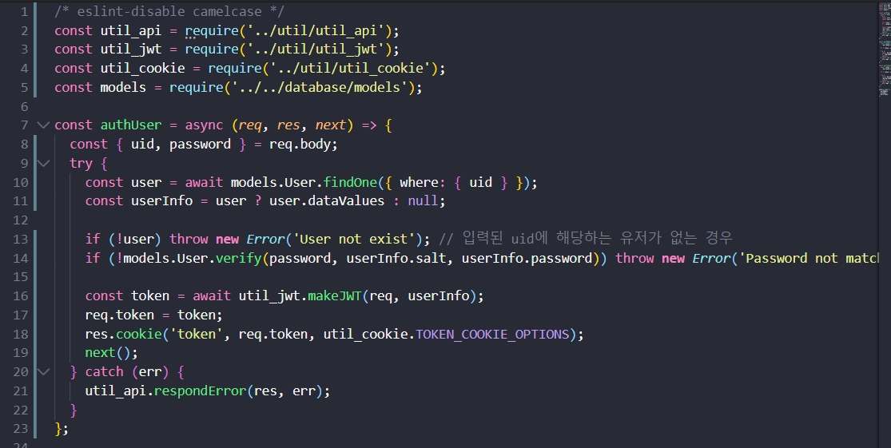
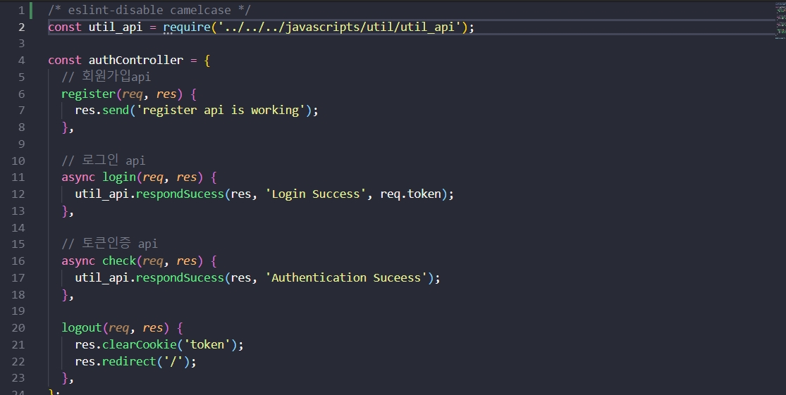
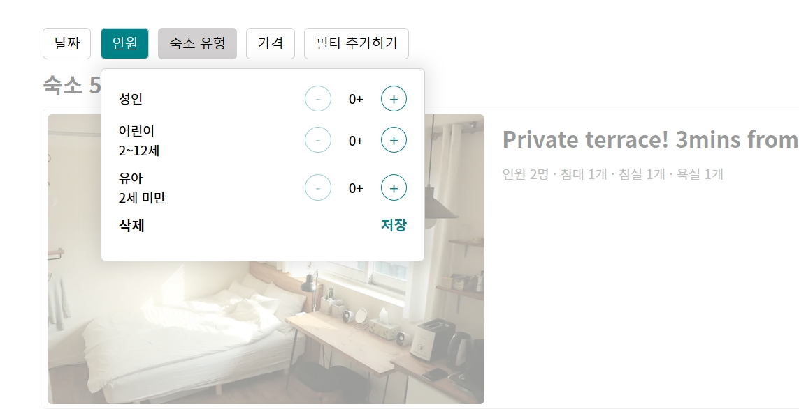
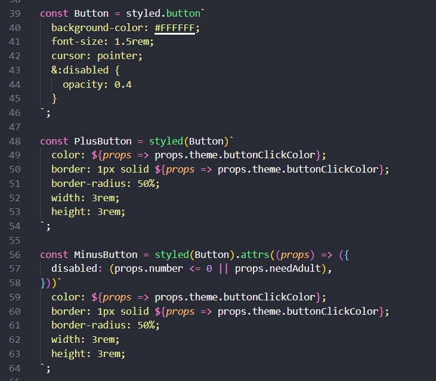
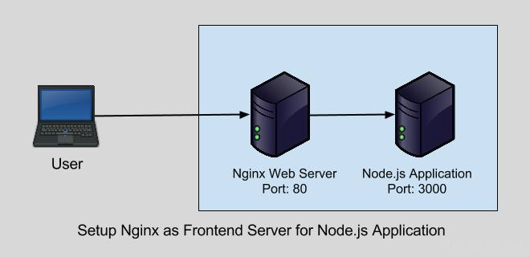

<!-- _class: gaia lead -->
# 처음하는 API + React
### 김한비

---
<!-- _class: gaia lead -->
# 도전
토큰이 뭐야?

어색한 API

처음보는 리액트

---
<!-- _class: gaia lead -->
# 보여줄 건 별로 없지만
초기 데이터

인원 필터링

---
<!-- _class: gaia lead -->
# 기술공유
모듈화

Styled Component

---
<!-- _class: gaia lead -->
# 모듈화 - 라우터

---
<!-- _class: gaia lead -->
# 모듈화 - 미들웨어

---
<!-- _class: gaia lead -->
# 모듈화 - 컨트롤러

---
<!-- _class: gaia lead -->
# 수많은 버튼...

---
<!-- _class: gaia lead -->
# Styled Component
스타일이 추가된 컴포넌트

컴포넌트? 재사용

컴포넌트? pass props

---
<!-- _class: gaia lead -->
# 버튼

---
<!-- _class: gaia lead -->
# 어려웠던 배포
프록시 서버의 개념

nginx + react + express

---
<!-- _class: gaia lead -->
# 동작방식의 이해

---
<!-- _class: gaia lead -->
# 이해하니 쉬워요
빌드파일 생성

nginx 권한부여

프록시 설정

API서버 구동

---
<!-- _class: gaia lead -->
# 뛰어나진 못해도
리액트 개념 토론

매일 질문

사소한 것 알려주기

---
<!-- _class: gaia lead -->
# 아쉬움
